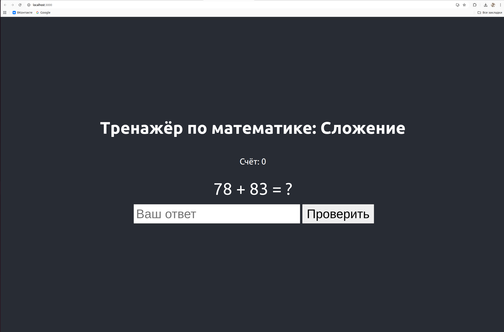
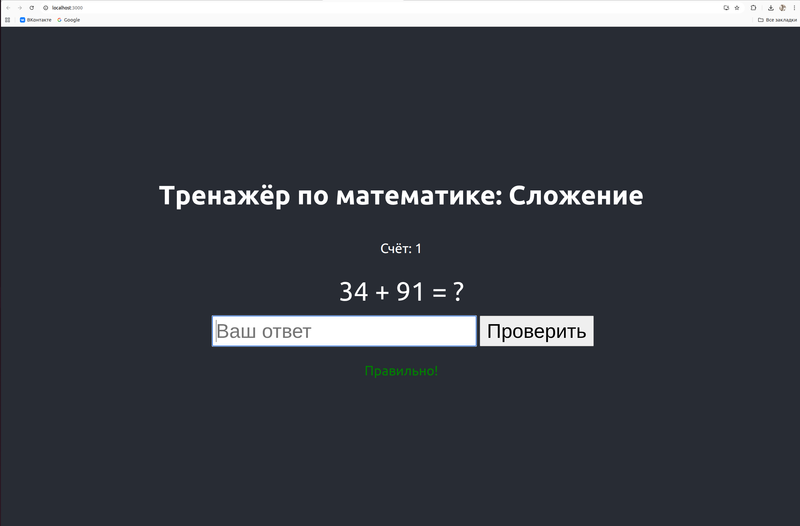
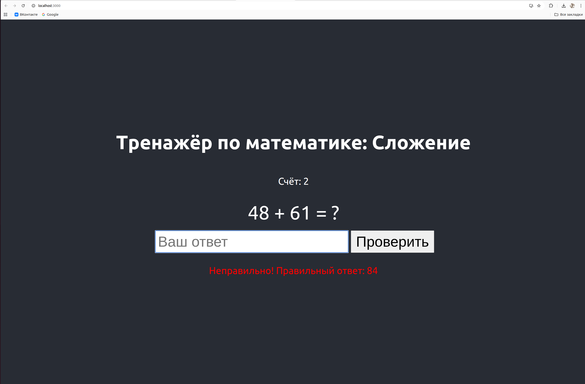

# Math Trainer React

Простой тренажёр по математике на React для практики сложения. Разработан в рамках контрольной работы по курсу React.

## Описание
Приложение генерирует случайные примеры на сложение (числа от 1 до 100), позволяет вводить ответ, проверяет его и сохраняет счёт в localStorage. Демонстрирует работу с компонентами, состоянием (useState, useEffect), событиями и хранением данных.

## Установка и запуск
1. Клонируйте репозиторий: `git clone https://github.com/ваше-имя/math-trainer-react.git`
2. Установите зависимости: `npm install`
3. Запустите: `npm start` (откроется на http://localhost:3000)

## Функционал
- Генерация случайных примеров.
- Проверка ответа с обратной связью.
- Счётчик правильных ответов с сохранением в localStorage.
- Автоматическое обновление примера после проверки.

## Особенности реализации
- Компоненты: MathExample.js для формы и примера.
- Утилиты: generateExample.js для генерации примеров.
- Стили: App.css.
- Хранение: useEffect для localStorage.

## Скриншоты

